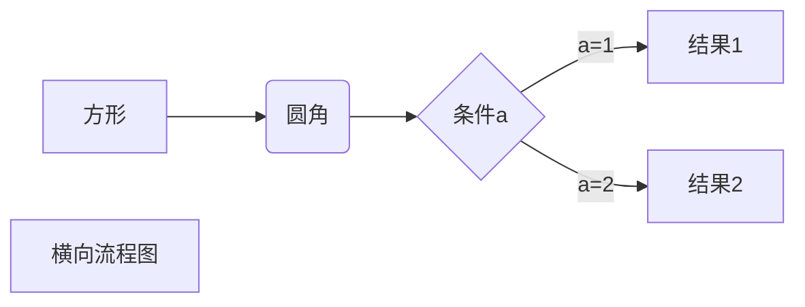
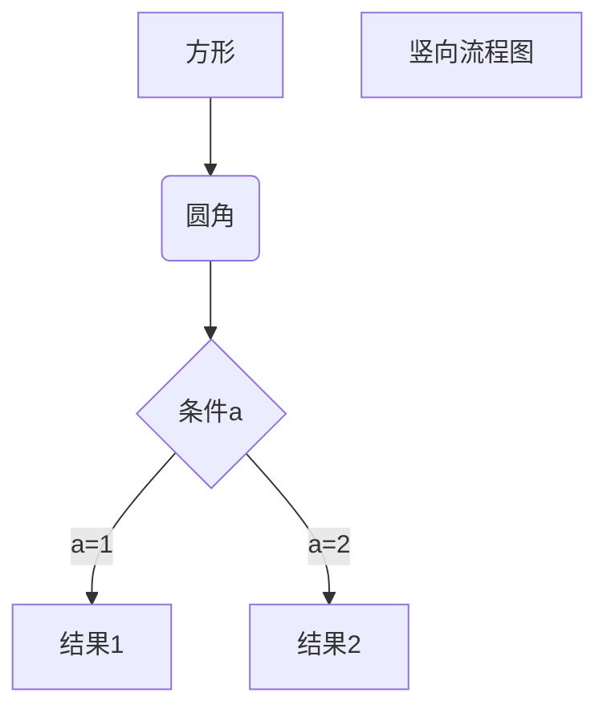
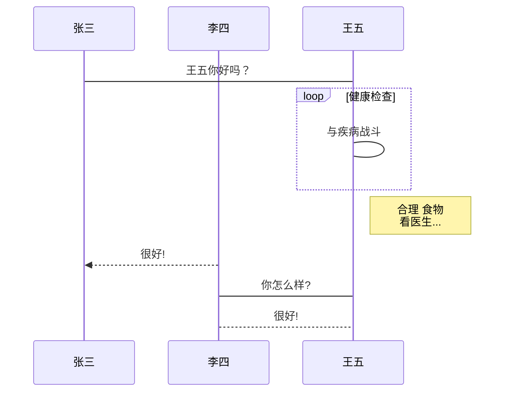
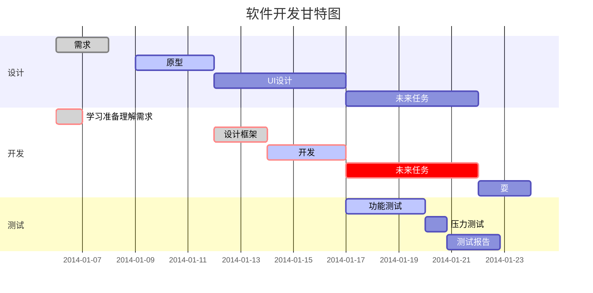

# 1 Introduction

Markdown is easy mark language, created by *John Gruber*(US) in 2004.

Featrue :

- Easy and concision
- HTML compatible 
- Chart and formula support
- Can be export as HTML, doc, PDF etc

Tips : markdown document end with .md or .markdown.

# 2 Title  

Start with \# in a line, as below (1~6 level support) :

\# Level 1  
\## Level 2  
\### Level 3  
\#### Level 4  
\##### Level 5  
\###### Level 6  

# 3 Paragraph

## 3.1 Line break

Add **two space** and **a CR** at the tail position or add a blank line before the newline.

## 3.2 Font

Add one \* or \_ at both ends of text to make the italic style, and two pair is for bold sytle and three for italic-bold style, as below :

\*Italic style 1\*  
\_Italic style 2\_  
\*\*Bold style 1\*\*  
\_\_Bold Style 2\_\_  
\*\*\*Italic and Bold style 1 \*\*\*  
\_\_\_Italic and Bold style 1 \_\_\_  

## 3.3 Line

### 3.3.1 Divid line

Three or more \- continues connection

### 3.3.2 Delete line

Two ~ at both ends of text.

### 3.3.3 Under line

Nothing used for markdown but HTML \<u\>\</u\>

## 3.4 Annotation

Text or image note for extra infomation which will be displaied when the mouse hover or click.

\[^Text to be annotated\]  
\[^Text to be annotated\] This is annotation text.

# 4 List

Start with \* or \+ or \- (for unordered list) or 'digtal.' (for ordered list) at the begin of the each line of the list, and intentation with a tab (or four space) to start sub-list.

Tips : Nest list can be used.

# 5 Block

Start with \> to make a block, as below :

\> block  
\> \> block nest 1  
\> \> \> block nest 2  

# 6 Code

Add \` (for one code line) or \`\`\` (for multi code line) at both ends of code, and programming language can be declared after the front end \`\`\`. 

# 7 Link ,target and image

\[Annotation Text](web link address) or \[Annotation Test](#local target ID).

\

# Form

> | Head1 | Head 2 | Head 3| ...
alignment style
|ceil     |ceil    |ceil|...
|ceil     |ceil    |ceil|...
|ceil     |ceil    |ceil|...
...

alignment style : 

\-  none
\:- left  
\-: right
\:-: middle

# Math Formula

Wrap TeX or LaTeX with two $

# Escape

use \\

# Flow chart

1、横向流程图源码格式：



2、竖向流程图源码格式：



3、标准流程图源码格式：

```flow
st=>start: 开始框
op=>operation: 处理框
cond=>condition: 判断框(是或否?)
sub1=>subroutine: 子流程
io=>inputoutput: 输入输出框
e=>end: 结束框
st->op->cond
cond(yes)->io->e
cond(no)->sub1(right)->op
```
4、标准流程图源码格式（横向）：

```flow
st=>start: 开始框
op=>operation: 处理框
cond=>condition: 判断框(是或否?)
sub1=>subroutine: 子流程
io=>inputoutput: 输入输出框
e=>end: 结束框
st(right)->op(right)->cond
cond(yes)->io(bottom)->e
cond(no)->sub1(right)->op
```
5、UML时序图源码样例：

```sequence
对象A->对象B: 对象B你好吗?（请求）
Note right of 对象B: 对象B的描述
Note left of 对象A: 对象A的描述(提示)
对象B-->对象A: 我很好(响应)
对象A->对象B: 你真的好吗？
```
6、UML时序图源码复杂样例：

```sequence
Title: 标题：复杂使用
对象A->对象B: 对象B你好吗?（请求）
Note right of 对象B: 对象B的描述
Note left of 对象A: 对象A的描述(提示)
对象B-->对象A: 我很好(响应)
对象B->小三: 你好吗
小三-->>对象A: 对象B找我了
对象A->对象B: 你真的好吗？
Note over 小三,对象B: 我们是朋友
participant C
Note right of C: 没人陪我玩
```
7、UML标准时序图样例：


8、甘特图样例：



# HTML
